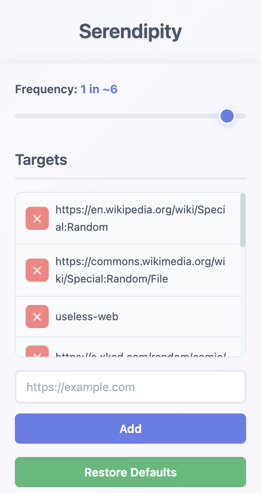

## Serendipity

Move out of your comfort zone and discover new things — right from your browser.

---

### What is Serendipity?

Serendipity is a Chrome extension designed to inject a little randomness and fun into your daily browsing. It occasionally changes the links on the pages you visit to take you somewhere unexpected — a random Wikipedia article, a quirky web toy, or a fascinating fact. The goal: help you break out of your routine and discover something new, every day.

---

### Features

- **Random Link Redirection:** Replaces a configurable percentage of links on any page with links to random, interesting, or whimsical sites.
- **Customizable Frequency:** Use the popup to set how often links are changed (e.g., 1 in 10, 1 in 50, etc.).
- **Editable Target List:** Add, remove, or restore default destinations for your serendipitous journeys.
- **Beautiful UI:** Clean, modern popup for easy configuration.

---

### How to Install

1. **Clone or Download this Repository.**
2. Open `chrome://extensions` in your browser.
3. Enable **Developer mode** (top right).
4. Click **Load unpacked** and select this project folder.
5. Pin Serendipity to your toolbar for easy access!

---

### How to Use

1. Click the Serendipity icon in your browser.
2. Adjust the frequency slider to control how often links are changed.
3. Add or remove target sites as you wish.
4. Browse as usual — and enjoy the surprises!

**Note:** Changes take effect after you reload the page.

---

### Screenshots

---

### License

MIT
